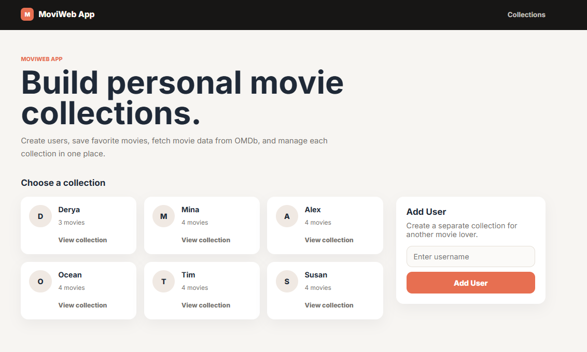
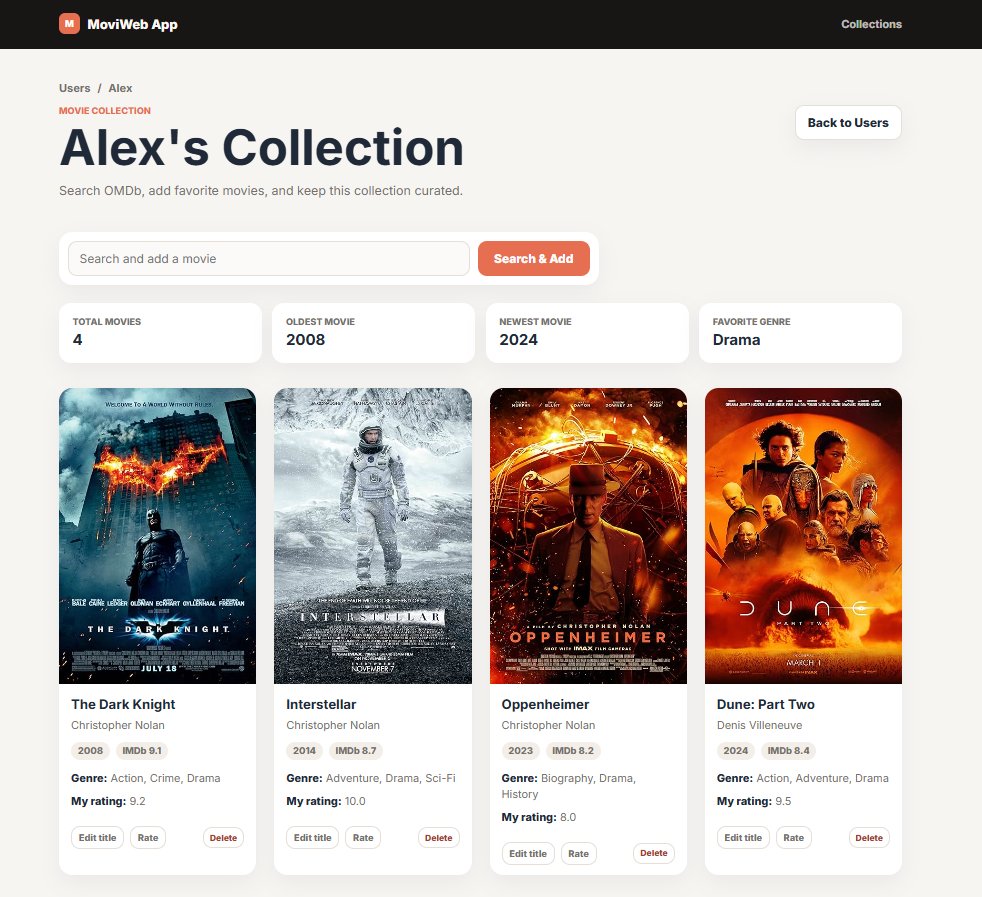

# 🎬 MoviWeb App

A modern Flask-based movie collection manager that allows users to create personal movie collections, search for movies through the OMDb API, and organize their favorite films in a clean and responsive web application.

## ✨ Features

* Create and manage multiple user movie collections
* Search and import movies directly from the OMDb API
* Automatically fetch:

  * Movie posters
  * Director information
  * Release year
  * Genres
  * IMDb ratings
* Add personal movie ratings
* Edit movie titles
* Delete movies from collections
* Responsive and custom-designed user interface
* Automatic demo collections and movies for first-time visitors
* Deployment-ready configuration for Render

## 🛠️ Tech Stack

* Python
* Flask
* Flask-SQLAlchemy
* SQLite
* Jinja2 Templates
* HTML5
* CSS3
* OMDb API
* Gunicorn
* Render

## 📸 Screenshot

### Movie Collection

## 🚀 Getting Started

1. Clone Repository: `git clone <repository-url>`
2. Enter Project Folder: `cd MoviWebApp`
3. Create `.env`: `API_KEY=your_omdb_api_key`
4. Install Dependencies: `pip install -r requirements.txt`
5. Run Application: `python app.py`
6. Open Browser: `http://127.0.0.1:5000`

## 🌐 Deployment on Render

1. Build Command: `pip install -r requirements.txt`
2. Start Command: `gunicorn app:app`
3. Environment Variable: `API_KEY=your_omdb_api_key`

The database is initialized automatically on startup.

If the database is empty, demo users and movie collections are created automatically so visitors can immediately explore the application.

## 📚 What I Learned

This project helped me strengthen my skills in:

* Flask application architecture
* SQLAlchemy models and relationships
* CRUD operations
* Working with external APIs
* Database design
* Jinja templating
* Responsive UI development
* Deployment workflows
* Environment variable management
* Building portfolio-ready web applications

## 🎯 Project Goal

The goal of this project was to transform a command-line movie application into a fully functional web application using Flask, SQLAlchemy, and the OMDb API while focusing on usability, clean architecture, and modern UI design.

---

Built with Python, Flask, and a passion for movies.
